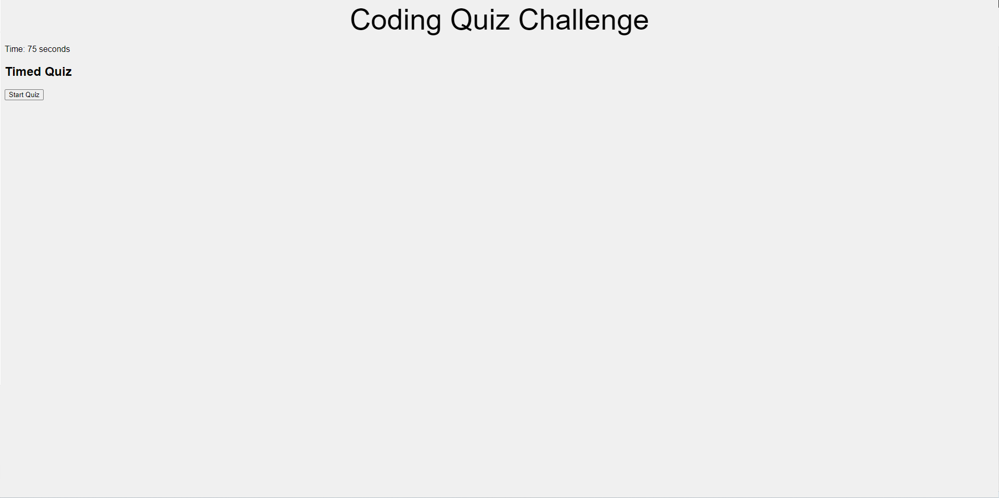

# javascript-quiz
Quiz on JavaScript concepts

The purpose of this quiz is so anyone who takes this can show they have some knowledge of the JavaScript programming language.

I did not fully finish this application and intend on resubmitting it once it is more complete.

I have a few additional sources for my code for this application:
- Class assignments
- A study group I worked with
- ChatGPT

## Website URL

https://troymena.github.io/javascript-quiz/

## Website Screenshot

The screenshot below shows the website at the time of writing this README file:

